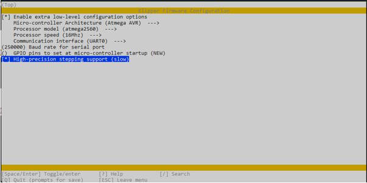

# Configuration reference for Bleeding Edge features

This document is a reference for options available in the Klipper
config file for bleeding edge features. Refer to the [Bleeding Edge Documentation](Bleeding_Edge.md) for details on specific features.

The descriptions in this document are formatted so that it is possible
to cut-and-paste them into a printer config file. See the
[installation document](Installation.md) for information on setting up
Klipper and choosing an initial config file.

## High precision stepping and new stepcompress protocol

This feature is enabled during klipper firmware compile
by selecting "High-precision stepping support" option in menuconfig.
The firmware then needs to be flashed to all MCU(s) using this feature.



The following configuration line should be added to each stepper in **printer.cfg**.
For example in a CoreXY system the config line would be added to [stepper_x] and [stepper_y]
so that it is enabled in both steppers controlling the X-Y movement of the toolhead.

```
[stepper_... ]
high_precision_step_compress: True
```

Note that enabling this feature in the config without recompiling and flashing the firmware will give an error.

## Input shaper

### [input_shaper]

**Extruder PA Synchronization with Input Shaping**

```
[input_shaper]
enabled_extruders: extruder
```

**Smooth Input Shapers**

```
[input_shaper]
shaper_type:
#   A type of the input shaper to use for both X and Y axes. Supported
#   shapers are smooth_zv, smooth_mzv, smooth_ei, smooth_2hump_ei, smooth_zvd_ei,
#   smooth_si, mzv, ei, 2hump_ei.
#shaper_type_x:
#shaper_type_y:
#   If shaper_type is not set, these two parameters can be used to
#   configure different input shapers for X and Y axes. The same
#   values are supported as for shaper_type parameter.
smoother_freq_x: 0
#  A frequency (in Hz) of the smooth input shaper for X axis.
smoother_freq_y: 0
#  A frequency (in Hz) of the smooth input shaper for Y axis.
#damping_ratio_x: 0.1
#damping_ratio_y: 0.1
#   Damping ratios of vibrations of X and Y axes used by input shapers
#   to improve vibration suppression. Default value is 0.1 which is a
#   good all-round value for most printers. In most circumstances this
#   parameter requires no tuning and should not be changed.
#   Note: Damping ratios are not currently supported for input smoothers.
```

## Test print utilities

### [ringing_tower]

Ringing tower test print utility which isolates vibrations to one axis at a time.

```
[ringing_tower]
size: 100
#   X-Y Size of tower footprint (mm)
height: 60
#   Height of of tower (mm)
band: 5
#   Height for each ringing step (mm)
perimeters: 2
#   Number of perimeters to be printed for the tower
velocity: 80
#   Is the velocity one must use as V in a formula V * N / D when
#   calculating the resonance frequency. N and D are the number of
#   oscillations and the distance between them as usual:
brim_velocity: 30
#   Speed for brim printing in (mm/s)
accel_start: 1500
#   The acceleration of the start of the test
accel_step: 500
#   The increment of the acceleration every `band` (mm/s^2)
layer_height: 0.2
first_layer_height: 0.2
filament_diameter: 1.75

#   Parameters that are computed automatically, but may be adjusted if necessary

#center_x:
#   Center of the bed by default (if detected correctly)
#center_y:
#   Center of the bed by default (if detected correctly)
#brim_width:
#   Computed based on the model size, but may be increased

#   Parameters that are better left at their default values

#notch: 1
#   Size of the notch in mm
#notch_offset:
#   0.275 * size by default
#deceleration_points: 100
```

### [pa_test]

Pressure advance tower test print utility

```
[pa_test]
size_x: 100
#    X dimension tower size  (mm)
size_y: 50
#    Y dimension tower size  (mm)
height: 50
#   Height of tower (mm)
origin_x:
#   Center of the bed in x
origin_y:
#   Center of the bed in y
layer_height: 0.2
first_layer_height: 0.3
perimeters: 2
#   Number of perimeters to be printed for the tower
brim_width: 10
#   Width of brim (mm)
slow_velocity: 20
#   Start velocity for PA test segment (mm/s)
medium_velocity: 50
#   Medium velocity for PA test segment (mm/s)
fast_velocity: 80
#   End velocity for PA test segment (mm/s)
filament_diameter: 1.75
```
